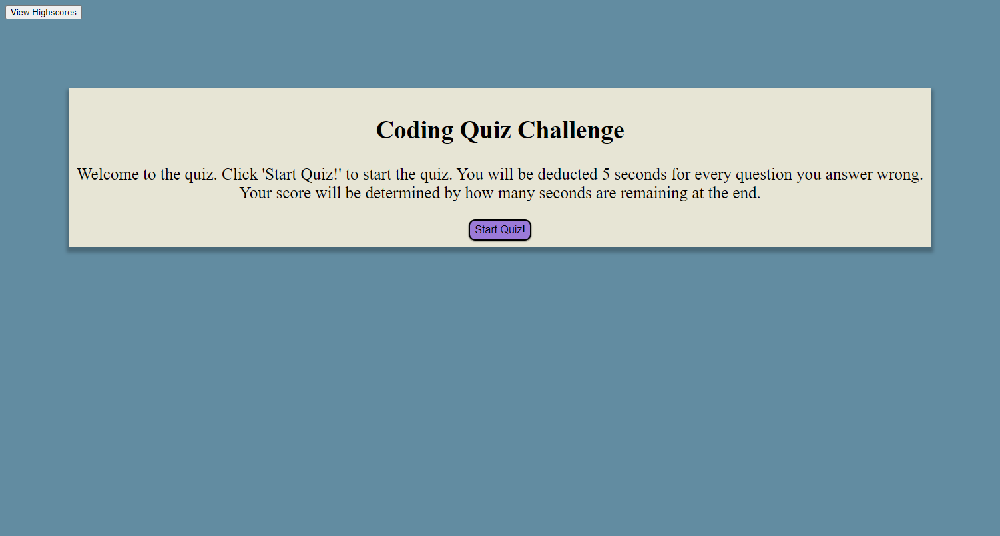

# Coding Quiz

## Description

This is a simple timed Coding Quiz made mostly with JavaScript to hone my skills using js. I learned about local storage, event listeners, timers, DOM navigation and many other things. 

## Installation

N/A

## Usage

Click the Start Quiz! button to begin the quiz. You have 30 seconds to complete the quiz. You will be deducted 5 seconds for every question you answer wrong. Your final score will be the time remaining at the end of the quiz. Upon completing the quiz you will be brought to the high score submittal screen where you can enter your initials and save your score. You can also view the saved highscores once you enter your score, or by pressing the View Highscores button in the top left.

## Credits

N/A

## Features

Uses a timer during the quiz with a 5 second adjustment if a question was answered wrong. Uses local storage to store scores and initials. 